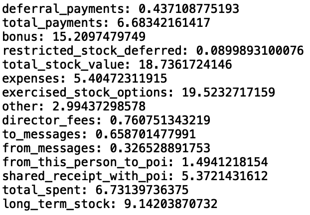

## The goal of the project

The goal of this project is to find the employes that may have commited fraud on Enron bankruptcy case. To accomplish that we use Machine Learning, a technique that make the algorithm learn from a data set, so that way we can make predictions with those data who may have commited fraud or not.

### Characteristics of dataset

- There are a total of 146 rows, and 12,5% of those rows POI person.
- There are a total of 21 features, and this is the total of NaNs values from each features:

- Those that have more than 100 NaNs is removed from the dataset.

### Outliers

The firsts outliers to be removed is the TOTAL and THE TRAVEL AGENCY IN THE PARK in the dictionary.

Then those person that have more than 15 fetures that is NaN values is removed from the dataset.

The others are most from POI to be more specific most from directors of the company, so it's a data needed for the project.

## Understanding the Dataset

### What features is used in the project.

The features used in this project are: `exercised_stock_option` and `total_stock_value`. For this project I made `total_spent` that sum the salary and expenses of a person, so that way we can know the year spent with that person. For features selection I used SlectKBest for automate my selection and the result of the score was this: 

Like we can see from images bellow the best result is the one that only use 2 features:

#### K=1

#### K=2

#### K=3

### Did need to do any scaling?

No, both AdaBoost and Random Forest doesn't need any scaling.

## Pick an algorithm

This project is end up using AdaBoostClassifier. And was tried to used RandomForestClassifier. The AdaBoost metrics is closer in both Precision and Recall of the 0.3, like can see in the two images below:

## Tune the algorithm

A small parameters change can have a greater impact the results of the algorithm. For this algorithm I used GridSearchCV to check with of the parameters have the best tuning for the AdaBoost, you have to pass the classifier and the parameters to be checked. 
The parameters tunning was: (algorithm='SAMME.R', base_estimator=None, learning_rate=0.9, n_estimators=200, random_state=42)

## Validation

It's a technique to train and test the datasets, it's give you an estimate of perfomace on an independent dataset, and help to prevent overfitting.

A classical error can be done in this example: Imagine that you have typical items used by 2 person and then you split your data the training data in a way that is entirely from item of the first person, and the testing data is almost entirely from second person, then your algorithm can't predict from who is those itens.

This analisys is validated by using StratifiedShuffleSplit.

## Evaluation Metrics

For this project is used 2 Evaluation Metrics, with is precision and recall. The precision is that from all itens that is marked as positive how many of then is belong to positive class, in case of this project the Precission is 42.53% that means that the project has a medium change to give False Positive value. And recall is from all that are trully positive values how many is correctly identify as positive wich means the higher the low the chance to it be a False Negative. In this project the recall is 34.05% wich means it have a high to medium rate to give a false negative.
